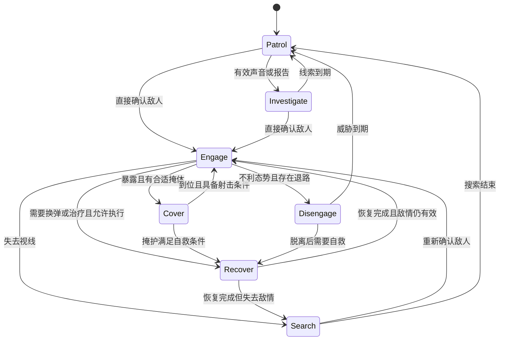
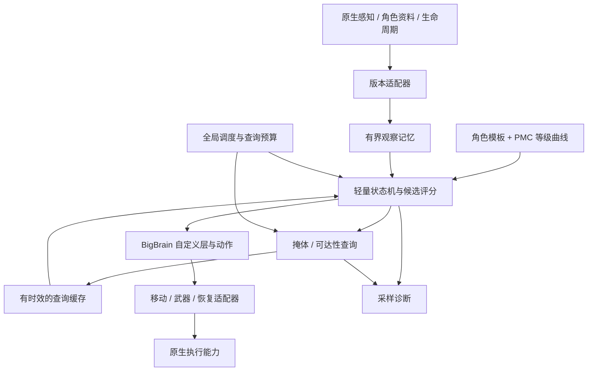

# 轻量化拟真 Bot 行为模组设计 v0.1

日期：2026-09-22。项目暂名：`ai_behavior_opt`。状态：设计草案，尚未实现行为插件或进行游戏内性能测试。

本文中的源码结论来自本地锁定版本；架构、参数、预算和验收门槛属于本项目的设计提议。参数表用于启动开发与调试，不代表已经验证的游戏平衡或性能结果。

## 1. 目标与设计结论

开发一个以“信息有限、反应自然、行动有目的”为核心的 SPT 客户端 Bot 模组。通过较少的行为模块、复用原生执行能力和统一计算预算，争取比 SAIN 更低的额外 CPU 开销，同时保留交战中可感知的战术差异。

主要决策如下：

1. **独立替代 SAIN 的行为接管部分。** 以 BepInEx、Harmony、BigBrain 为基础；SAIN 仅作为参考，不作为运行依赖。
2. **Scav 使用固定职业模板。** 普通 Scav 与狙击 Scav 可以不同；同一种模板不随等级成长。
3. **Boss、护卫与特殊 AI 优先保留原生专属逻辑。** 不把所有 Boss 套入通用 PMC 状态机；后续按具体角色增加固定适配模板。
4. **PMC 使用同一套行为库，能力参数随自身等级线性变化。** 高等级提升反应、判断和协作质量，不增加射线数量、寻路预算或更新频率。
5. **优先完成交战拟真。** 首版涵盖巡逻衔接、调查、交战、掩体、搜索、恢复与脱离；完整搜刮、任务、撤离、复杂投掷物战术不在首版承诺范围内。

“固定逻辑”指规则与能力基线固定，仍会根据受伤、弹药、威胁与位置选择行动；“线性提高”指受等级控制的能力参数线性变化，不承诺击杀率或胜率随等级线性增长。

## 2. 版本、依赖与边界

| 项目 | 本次设计基准 | 用途 |
| --- | --- | --- |
| SPT / EFT | 4.1.5 / 0.16.9.5.40743 | 目标安装环境 |
| SAIN | 4.5.1，`2d1d9257dbb3af535e9189e6181311f6355aec27` | 行为与性能方案参考 |
| BigBrain | 1.5.0，`4d26e8b0441d845933941eb0509cbe4e04ed2788` | 行为层与动作扩展 |
| 客户端工程 | C#，`netstandard2.1` | 首版交付形态 |
| 本机 SDK | .NET SDK 10.0.401，显式调用便携安装 | 编译工具，不是游戏运行时替换 |
| 服务端工程 | 首版不要求；需要时按本地 SPT 使用 `net10.0` | 后续可选生成配置，不承担实时 AI |

版本依据：[Bot 参考源码锁定记录](../reference/bot-mod-sources.lock.json)、[SPT 锁定记录](../reference/spt_source_code/sources.lock.json)。本机客户端与服务端最小工程已有编译通过记录，参见[构建环境说明](../tools/build-check/README.md)；这不等于本设计的插件已经可运行。

Bot 自身等级可从目标版本参考实现中的 `BotOwner.Profile.Info.Level` 获取，角色来自 `Profile.Info.Settings.Role`，因此没有为成长模型单独引入服务端 Mod 的必要。新工程仍须通过目标游戏程序集验证这些访问点。[源码：BotProfile](../reference/SAIN/SAIN/Classes/Bot/Info/BotProfile.cs)

首版不承诺 Fika 联机兼容、不修改玩家存档、不改变 Bot 生成等级与装备分布、不重建整个 SPT 服务端。依赖的游戏 DLL 只作编译引用，不打包进发布文件。

## 3. SAIN 已经优化了哪些方面

SAIN 同时扩展行为和控制计算开销。下面的频率是该版本源码中的局部调度参数，实际执行还受 Bot 状态、协程和筛选条件影响，不能解释为全部 Bot 始终按该频率完成所有工作。

| 方向 | 匹配版本中的做法 | 本项目的取舍 |
| --- | --- | --- |
| 战斗决策 | 决策管理器设有 `1/10 s` 更新间隔；组合战斗、自救、危险回避和部分特殊角色逻辑 | 使用更少的状态和有界评分；普通战术重选目标 5 Hz，紧急事件单独唤醒 |
| 视觉 | 视觉任务有 `1/30 s` 调度间隔；筛选敌人与身体部位，执行多类射线，使用 `RaycastCommand.ScheduleBatch` 和跨帧协程 | 优先读取经过验证的原生观测；只为关键交火和候选位置补充少量查询，暂不重做完整多部位视觉系统 |
| 掩体 | 有启停控制、缓存、约 4 秒的碰撞体重采集间隔、默认最多 5 个有效候选，以及循环内让出帧的处理 | 复用已有可靠候选；失效时做小范围有界补充；全局共享查询预算，限制失败重试 |
| AI 降频 | 按最近人类玩家距离分级，并对正在处理人类敌人的 Bot 取消该限制 | 采用战斗/警戒/空闲分级；远处 Bot 对 Bot 交火同样保持战斗等级 |
| 听觉 | 处理声音定位误差、听觉条件与相关搜索行为 | 保留声音事件、距离衰减、定位误差和过期机制；首版不实现复杂逐层遮挡传播 |
| 枪械与瞄准 | 处理瞄准、弹道补偿、后坐力、装备及状态影响 | 复用原生武器与弹道；用反应和稳定过程体现熟练程度，避免重建完整射击模拟 |
| 小队 | 包含队友状态、通信、掩护、协同搜索等判断 | 后续只做延迟报点、有限掩护与单个侧移者；不做全队排列组合 |
| 性格与动作 | 提供性格、动作与多种战术组合 | 个体仅保存少量稳定倾向；使用固定动作集合，不为每个性格建立独立组件树 |
| 配置与展示 | 完整预设与界面系统 | 首版采用 BepInEx 配置与限频诊断，不制作独立复杂 UI |

对应源码：[决策](../reference/SAIN/SAIN/Classes/Bot/Decision/BotDecisionManager.cs)、[视觉任务](../reference/SAIN/SAIN/Classes/BotManager/Jobs/VisionRaycastJob.cs)、[掩体](../reference/SAIN/SAIN/Components/CoverFinderComponent.cs)、[掩体分析](../reference/SAIN/SAIN/Classes/Coverfinder/CoverAnalyzer.cs)、[AI 降频](../reference/SAIN/SAIN/Classes/Bot/SAINAILimit.cs)、[听觉误差](../reference/SAIN/SAIN/Classes/Bot/Sense/Hearing/HearingDispersion.cs)、[瞄准](../reference/SAIN/SAIN/Classes/Bot/WeaponFunction/AimClass.cs)、[后坐力](../reference/SAIN/SAIN/Classes/Bot/WeaponFunction/Recoil.cs)、[小队决策](../reference/SAIN/SAIN/Classes/Bot/Decision/SquadDecisionClass.cs)、[功能说明](../reference/SAIN/README.md)。

**轻量化不能仅凭“模块比 SAIN 少”成立。** 保留原生系统再叠加新逻辑也可能增加总开销；必须记录实际被替换和保留的工作，比较完整客户端帧时间以及 AI 热点。

## 4. “像真人”的可观察行为

| 场景 | 期望行为 | 必须避免的表现 |
| --- | --- | --- |
| 突然看到敌人 | 先完成察觉与武器准备，再稳定开火 | 一见面立即完成转身、锁定、射击 |
| 只听见声音 | 朝带误差的声音区域观察或调查 | 得到隔墙目标的实时坐标并持续跟踪 |
| 敌人退回掩体 | 记住最后位置，观察出口或有限搜索 | 持续把枪口精确对准不可见敌人 |
| 自己暴露 | 优先使用已有近处掩体；无合适掩体时控制交火或退回已知位置 | 每次状态变化都遍历整片地图寻找“最佳掩体” |
| 弹药不足或受伤 | 结合威胁与遮挡决定换弹、治疗或脱离 | 战斗中反复打断治疗、在原地循环换弹 |
| 长时间失去目标 | 信息置信度降低，搜索到期后恢复原任务 | 无限追踪最后一个敌人、跨地图穷追不舍 |
| 小队遭遇敌人 | 有报点延迟，有人看守、有人有条件侧移 | 全员同时精确获知敌人坐标并冲向同一位置 |

拟真不等于普遍变强。低等级 PMC 仍能完成全部基本动作，但更慢、更容易误判；高等级 PMC 更善于选择时机，仍受视野、装备、伤势、弹药和可达性约束。

## 5. 角色分类与固定模板

### 5.1 分类顺序

使用目标版本角色枚举白名单，按以下顺序匹配：Boss/护卫/特殊 AI → PMC → 普通或狙击 Scav → 未知角色。不能仅凭 USEC/BEAR 阵营判定 PMC。未识别角色保持原生行为，并限频记录诊断信息。

### 5.2 首版角色策略

| 角色 | 行为模板 | 等级作用 | 接管范围 |
| --- | --- | --- | --- |
| 普通 Scav | 原生巡逻衔接、局部调查、直接交战、近处掩体、短距离追击、自救 | 不影响本模组能力参数 | 小型固定策略 |
| 狙击 Scav | 保持守点与观察方向，受威胁时有限调整位置 | 不影响本模组能力参数 | 专用固定策略；保留原生驻点约束 |
| Boss | 保留原生阶段、区域、武器及特殊动作规则 | 不使用 PMC 成长模型 | 默认 `NativePreserve` |
| Boss 护卫 | 保留护卫、集合与 Boss 协作规则 | 不使用 PMC 成长模型 | 默认 `NativePreserve` |
| Raider、Rogue、邪教徒、感染者等特殊 AI | 首版保留原生；后续逐类验证 | 不自动套用 PMC 曲线 | 默认 `NativePreserve` |
| PMC | 通用交战状态机，加等级能力与少量固定个体倾向 | 读取该 Bot 自身等级 | 首版主要接管对象 |

普通 Scav 的候选初值：反应基线 1.1 秒、瞄准稳定时间 1.0 秒、标准声音定位误差 10 米、最后位置有效期 6 秒。狙击 Scav 单独配置，不能由普通模板自动获得主动包抄与离开岗位的行为。这些数值只是设计初值，需实测后调整。

“Boss 固定”在首版的实现含义是保留其既有专属规则，**不表示本模组已经重写或增强所有 Boss**。如以后调整 Tagilla、Killa 等角色，必须单列适配项和回归场景。SAIN 的决策源码本身就包含特殊 Boss 分支，说明通用接管不能直接替代这些规则。

个体差异可以在生成时抽取小幅、固定的胆量或偏好；同一 Bot 在战局中不每帧重新抽取“性格”。固定模板也不根据玩家击杀数或玩家等级暗中变化。

## 6. PMC 等级线性成长

### 6.1 统一公式

默认成长区间提议为 1～60 级，允许配置；60 是本模组的成长饱和点，不是对游戏等级上限的判断。

```text
L = 当前 PMC 的 Profile.Info.Level
t = clamp((L - Lmin) / (Lmax - Lmin), 0, 1)
参数 P(L) = P低级 + (P高级 - P低级) × t
默认 Lmin = 1，Lmax = 60
```

区间内每一级的参数增量相同，区间外保持端点。等级缺失时回退到 `Lmin` 并记录一次原因；非法区间 `Lmax <= Lmin` 回退到默认有效配置，不允许除零。生成时计算并缓存，首版战局内不动态升级。

不设置“20 级解锁侧移、40 级解锁包抄”等台阶；不随等级改变调度频率、掩体候选数量、观察目标数量或寻路次数。

### 6.2 能力曲线初值

以下值均为相同装备、环境和个体偏差下的基线，展示值四舍五入；运行计算使用完整精度。

| 参数 | 1 级 | 20 级 | 40 级 | 60 级 | 实际含义 |
| --- | ---: | ---: | ---: | ---: | --- |
| 察觉后反应时间 / 秒 | 0.900 | 0.707 | 0.503 | 0.300 | 有效观察到达后，何时允许作出针对性战斗响应 |
| 瞄准稳定时间 / 秒 | 0.800 | 0.655 | 0.503 | 0.350 | 武器进入可瞄准状态后，达到目标稳定程度所需基线时间 |
| 声音定位误差尺度 / 米 | 8.000 | 6.390 | 4.695 | 3.000 | 标准 30 米声音事件的水平定位不确定半径，不是听力范围 |
| 最后位置有效期 / 秒 | 6.000 | 8.576 | 11.288 | 14.000 | 保留过时位置线索的时间，不允许跟随真实目标更新 |
| 合理战术选择概率 | 0.300 | 0.477 | 0.664 | 0.850 | 在已合法、可达的动作中，选择当前评分最优项的概率 |
| 小队报点延迟 / 秒 | 1.200 | 0.942 | 0.671 | 0.400 | 从得到有效观测到发出报告的延迟；小队模块启用后使用 |

“合理战术选择概率”的剩余概率用于选择安全候选中的次优项，例如多观察片刻或维持现有掩体；不能随机选择穿墙射击、走入必死区域或中断紧急自救。只有决策上下文发生实质变化、或当前动作结束时才抽样一次，不能每个 5 Hz tick 重新赌博以变相提高成功率。

首次开火还必须满足原生武器就绪、合法视线与弹药条件。反应计时和瞄准稳定计时可并行，开火时间取各就绪时刻的最大值，不能无意把多个难度系统的同类延迟重复相加。初期通过适配器检查原生延迟的实际效果；若无法控制其叠加，就先交付战术曲线，并明确射击曲线尚未验证。

听觉误差先按等级求基线，再乘以固定的距离、环境修正；它不会制造原生系统未收到的声音。定位偏移在事件进入记忆时生成，不能因每次读取重新随机而暴露真实中心。

### 6.3 个体差异、装备和公平性

- 可对时间类参数加入生成时确定的零均值小偏差，候选幅度为 ±8%；测试线性曲线时关闭偏差。概率参数首版不附加偏差，避免截断破坏线性。
- 装备、负重、伤势和环境继续影响实际执行。等级不修改生命值、伤害、子弹速度，也不提供穿墙视野。
- 首版不通过等级直接降低真实武器后坐力。更好的射击表现来自准备时间、射击窗口、距离选择和原生武器执行；进一步的瞄准误差适配留待接口验证后设计。
- 不将原生 Easy/Hard 系数再次乘进本模组曲线。对无法消除的原生难度差异进行记录，对照测试固定难度，避免把混合效果误称为等级线性成长。
- 记录曲线基线与实际动作延迟两套数据。调度排队会影响实战延迟，不能用计算出来的参数代替实际表现。

## 7. 感知与记忆：只使用 Bot 已知的信息

### 7.1 统一观察记录

每条观察记录包含：来源、观察时间、目标标识（如果当时可识别）、观察位置、位置不确定度、置信度、过期时间。来源限于可验证的直接视觉、听觉事件和队友报告。

视觉丢失后固定最后观察位置；声音只给带误差的区域；队友报告保留原始观察时间与误差，并叠加通信延迟。转发不能刷新信息寿命，也不能产生比原报告更精确的位置。

每个 Bot 最多保存 4 个威胁记录，只有 1 个当前交战目标；优先淘汰过期、低置信度记录。该上限与等级无关。重复声音按声源/区域与短时间窗合并，避免自动武器射击导致事件队列无限增长。

### 7.2 原生系统的使用边界

优先利用原生感知已经完成的工作，但必须验证相关字段表示“当前确实看见”还是“系统知道这个对象存在”。决策层不接收未观察目标的实时 `Transform`，不因调查失败而回退到敌人真实位置。

同样检查执行层：即使决策只使用最后位置，原生瞄准、转向或追击仍可能自行访问目标位置。因此必须在 M0 验证射击许可、瞄准输入和移动目的地的控制边界；只改决策层不足以证明消除了异常追踪。

射击入口要求原生可用的当前视线确认；无法验证其可靠性时，在开始新的短连射前追加一次预算内验证。失去视线后取消直接瞄准与新连射，转为看守最后位置或搜索。验证未取得预算时推迟新连射，不能假定目标可见。

首版不增加隔墙压制射击；原生已在执行的连射如何安全停止、视线结果多久失效，必须结合目标版本接口验证。特殊 Boss 保留原生模式时，不宣称已经应用这套感知约束。

## 8. 行为状态与动作执行



图中省略从所有状态触发的死亡、销毁和原生紧急避险中断。侧移是 `Engage/Cover` 中的有界动作，不为每个战术创建独立大型子系统。

| 状态 | 核心工作 | 退出与保护 |
| --- | --- | --- |
| Patrol 巡逻 | 使用原生巡逻；可低频停留观察 | 有效观察唤醒；不扫描全场敌人 |
| Investigate 调查 | 靠近声音区域或选择观察点 | 有时间与距离上限；没有新证据就结束 |
| Engage 交战 | 准备武器、选择射击窗口、评估暴露 | 限制目标切换，优先完成当前有效动作 |
| Cover 掩体 | 移向已验证的近处位置，保持朝向 | 位置失效或卡住时有限重试；不能反复寻路 |
| Search 搜索 | 围绕最后位置选择最多 3 个固定候选点 | 不确定范围随信息老化扩大；搜索到期结束 |
| Recover 恢复 | 换弹、治疗、解除短期状态问题 | 尊重原生动作锁；仅真实紧急事件可以中断 |
| Disengage 脱离 | 返回已知安全方向或保留路径 | 无合法退路时采用当前可执行防御动作 |

普通战术动作使用候选 0.6 秒的最短持有时间与切换收益门槛，避免左右横跳；手雷、死亡、严重近身威胁等紧急情况可以打断。所有移动动作设置停滞检测和最多 2 次重规划，失败后暂时拉黑该目的地，回到可执行动作。

Scav 使用相同基础执行器，但候选动作由固定模板收窄；PMC 的等级影响选项质量与时机，不改变状态数量。Boss 保留模式不注册这套通用状态机。

## 9. 实现架构与接管边界



### 9.1 模块职责

下列类型名是拟定的自有模块名称，不代表 EFT 已存在这些 API。

| 模块 | 职责 | 主要限制 |
| --- | --- | --- |
| `PluginBootstrap` | 加载配置、检查依赖和版本、注册补丁 | 反射查找只在初始化执行，失败时明确降级 |
| `RaidRuntime` | 管理战局、Bot 注册/注销和共享服务 | 单一战局所有者，禁止跨战局持有 Bot 引用 |
| `RoleResolver / SkillProfile` | 判定模板，计算能力快照 | 创建时计算，不在热循环重建 |
| `PerceptionAdapter / BotMemory` | 提供有限、可追溯的信息 | 原生对象信息先经过观察合法性检查 |
| `DecisionController` | 状态迁移、固定候选评分 | 不直接寻路、不直接调用物理检测 |
| `QueryScheduler` | 请求合并、限额、超时与公平调度 | 同时限制总量、突发量与队列大小 |
| `CoverService` | 复用、筛选、验证掩体候选 | 每次最多 6 个粗选候选，最多 2 个进入昂贵验证 |
| `ActionExecutor` | 调用经过验证的原生移动、瞄准、恢复 | 控制权明确，禁止多个动作同时写移动目的地 |
| `SquadCoordinator` | 可选的报点与有限协作 | 只使用原生队伍，禁止全场 Bot 两两匹配 |
| `Diagnostics` | 统计耗时、调用量、等待时间及失败原因 | 默认聚合输出，不逐帧写日志 |

优先采用一个共享调度器和轻量 Bot 状态对象；不为每条感官、每种战术各创建一个常驻 `Update` 或无限协程。是否复用对象、采用数组池，由分配与持有量测量决定，不能以池化为由永久保存死亡对象。

### 9.2 BigBrain 接入

BigBrain 1.5.0 支持按 Brain 名称和 `WildSpawnType` 集合注册自定义层，也提供移除与恢复原生层的能力；`CustomLayer` 负责激活判断与动作选择，`CustomLogic` 负责动作生命周期。[注册与恢复接口](../reference/BigBrain/Brains/BrainManager.cs)、[CustomLayer](../reference/BigBrain/Brains/CustomLayer.cs)、[CustomLogic](../reference/BigBrain/Brains/CustomLogic.cs)

本项目先提议两个通用层：调查层与战斗层；恢复行为作为战斗状态下的动作或交还原生恢复层，具体取决于 M0 的控制权验证。层的 `IsActive` 只读取缓存标志，不在 Brain 每次询问时计算路径或寻找掩体。

接入前逐角色记录原生 Brain、Layer 名称、优先级和职责，确保紧急避险与角色专属行为仍能工作。优先级数值不直接照抄 SAIN 的 Solo/Squad/Extract 设置。只排除确认冲突的目标角色层，不对全部 Brain 全局删除相同名称的层。

一个 Bot 在同一时刻只有一个自有动作持有移动/射击控制权；层退出时停止其任务、取消旧请求、清理朝向或移动覆盖并交还控制。异常退出时撤销本模组的覆盖，恢复可用原生行为并记录降级原因。恢复原生模式后不再声称该 Bot 满足所有拟真约束。

### 9.3 生命周期与线程

- 创建时保存战局编号与 Bot 生命周期编号；异步或延后结果回收时必须匹配这两个编号，避免把旧结果应用到重生对象。
- 死亡、销毁、战局结束时解除事件订阅，取消排队请求，释放缓存、动作控制权与自有资源。
- Unity 对象、BotOwner、Transform 和普通 NavMesh 调用保留在主线程。首版不为“多线程”目标把这些调用放入 `Task.Run`。
- 只有性能数据表明射线调度值得优化后，才评估 Unity Job 批处理；使用可复用缓冲并处理完成、取消和释放。`RaycastCommand.ScheduleBatch` 是官方支持的射线批任务入口，但并不能让其他 Unity API 自动变成线程安全。[Unity API 文档](https://docs.unity3d.com/2022.3/Documentation/ScriptReference/RaycastCommand.ScheduleBatch.html)

## 10. 掩体、移动与小队的轻量化实现

### 10.1 掩体查询流水线

1. 当前掩体仍有效时继续使用；判断依据包括已知威胁方向、当前位置变化与缓存时间，而不是每帧重选最佳位置。
2. 优先读取原生可用掩体或近期成功位置。该入口是否足够可靠是 M0 验证项；尚未确认其接口。
3. 缺少可用候选时，申请一次有预算的小范围物理查询。候选缓冲初值最多 32 个碰撞体；满载时接受质量下降，不自动扩容并重新扫描。
4. 从候选中粗选最多 6 个位置，先做距离、方向与已知危险的便宜评分；最多 2 个位置申请遮挡和路径验证。
5. 跨帧分步处理验证。每个物理/寻路 API 调用各消耗对应令牌，不把“查一个掩体”当作一次调用而隐藏内部多次计算。
6. 找到足够好的可达位置即使用；无结果时维持仍有效动作，或回到已知可达位置。下一次重试需经过至少 0.8 秒冷却，并计入预算。

评分优先考虑已知威胁方向遮挡、移动距离和射击窗口；首版不做全地图最优路径与掩体联合求解。候选缓存按本地空间区域和威胁方向区分，动态门、位置改变或威胁方向显著改变时失效；不能把“静态几何存在”当作“当前一定安全”。

普通 `NavMesh.CalculatePath` 是同步调用，一次长路径就可能超过时间目标；返回 `true` 也可能只有部分路径。实现必须检查路径状态，不能只检查布尔返回值。[Unity 路径计算文档](https://docs.unity3d.com/2022.3/Documentation/ScriptReference/AI.NavMesh.CalculatePath.html)

### 10.2 搜索和移动

搜索点围绕最后一次观察位置生成，每条线索最多 3 个；无法到达时丢弃该点，不无限采样直到得到结果。移动每次只保留一个有效目的地，短时小幅目标抖动不触发重规划。

原生开门、避障、移动和武器动画继续按其需要运行。新模组降低的是高层重选频率，不能把原生每帧运动也降到 5 Hz。对移动接口可能内部触发的寻路单独计数或估计归因；仅限制显式 `CalculatePath` 不代表限制了全部路径开销。

### 10.3 小队后续范围

先复用既有队伍成员关系；每队维护一个短寿命报告和一个行动分配快照。最多 1 名成员尝试侧移，其余维持观察、交战或自救。成员按自身等级决定报点延迟与执行选择，队友报告不赋予直接射击权限。

队伍只在成员变化、有效新敌情或动作结束时重分配；使用一次成员遍历，不为所有成员组合计算路线。没有合适侧移路线就放弃协同动作。小队模块默认在单体行为验证后再启用，不作为首个原型的依赖。

## 11. 调度、预算与退化行为

### 11.1 调度频率初值

| 活跃级别 | 普通战术重选频率 | 唤醒条件 |
| --- | ---: | --- |
| 战斗 | 5 Hz | 有直接威胁、正在交火、受击或近身危险 |
| 警戒 | 2 Hz | 有有效声音/报告，处于调查或短期搜索 |
| 空闲 | 0.5 Hz | 无有效威胁，仅巡逻衔接与背景评估 |

频率针对新增高层决策。武器许可的时间比较、死亡和紧急避险检查必须及时处理，不等待下一次普通战术重选；它们只能做有界的轻量工作。事件触发的昂贵查询仍必须排队，不能借“紧急”无限绕过全局限制。

所有 Bot 使用稳定错峰；玩家不可见、距离远的 Bot 对 Bot 战斗也进入战斗级别。只降低可省略的战术评估，不冻结远处世界。跨级别切换设置短暂滞后，避免边界振荡。

### 11.2 全局预算初值

以下是供原型调优的起点，**不是已验证的最佳值或支持 Bot 数保证**。计数预算针对本模组新增/可控的查询，无法直接封顶所有原生 AI 工作。

| 资源 | 长期补充速率 | 桶容量与单帧上限 | 说明 |
| --- | ---: | ---: | --- |
| 补充射线 | 120 次/秒 | 8 / 8 次 | 新连射验证、候选遮挡共用；关键交火优先 |
| 完整路径计算 | 12 次/秒 | 1 / 1 次 | 候选可达性与可控重规划共用 |
| NavMesh 位置采样 | 36 次/秒 | 3 / 3 次 | 每次采样也计费；不把失败重试隐藏在循环内 |
| 局部碰撞体查询 | 6 次/秒 | 1 / 1 次 | 每次最多 32 个结果，不做全场扫描 |
| 新增主线程工作 | 每帧目标 0.5 ms | 软时间片 | 覆盖决策、调度与可归因的查询；达到目标后停止开启可推迟工作 |

令牌按战局时间补充、按桶容量封顶，同时遵守单帧上限；低帧率或长暂停后不能“补跑”全部欠账。举例：8 次射线的单帧上限不意味着 60 FPS 时允许稳定执行 480 次/秒，长期速率仍由 120 次/秒限制。

0.5 ms 是待验证的性能目标，不是可强制保证的硬截止。正在执行的同步路径调用无法被这套调度器中断；必须单独记录最慢调用和时间片超支。Unity Job 等待时间、引起的原生执行成本也不能从性能报告中排除。

### 11.3 有界队列、公平与退化

- 每个 Bot 对同类查询最多保留 1 个待处理请求，后来的相同请求更新上下文，不无限追加；全局队列上限为 `min(4 × 接管 Bot 数, 256)`。
- 请求携带优先级、创建时间、最晚有效时间与场景版本；过期、目标变化或 Bot 销毁时撤销。初值建议射击确认 0.2 秒、候选掩体 1 秒，最终按测量调整。
- 单帧射线预算中最多预留 4 次给关键交火验证，未使用额度可被其他请求借用；这个预留包含在总上限 8 次内，不是额外额度。各类任务均受令牌余额限制。
- 同优先级轮转服务不同 Bot；普通请求随等待时间适度提升顺位。队列已满时优先丢弃过期或可选请求，不能让一个失败 Bot 长期占据队首。
- 负载上升时依次减少可选侧移、额外候选验证与背景搜索；继续使用有效缓存和当前动作。死亡、原生紧急避险与合法射击检查不能被质量退化关闭。
- 射击验证排队过久时推迟开火，并计入行为质量失败指标；不能用让 Bot 长时间不射击来“达成绩效”。大量 Bot 同时首次接敌可能耗尽验证预算，这是需要压力测试和调参的显式风险。

稳定运行热路径目标为无持续托管分配；初始化和有界事件允许必要分配。避免在循环中使用反射、LINQ 创建临时集合、生成日志字符串或查找全场对象。发布配置关闭逐 Bot 的持续详细日志，保留低频汇总和按需追踪。

## 12. 配置与兼容策略

### 12.1 最小配置面

| 配置项 | 建议默认值 | 生效时机 |
| --- | --- | --- |
| 模组开关 | 开启 | 战局开始前 |
| 普通/狙击 Scav | 固定模板 | Bot 创建时 |
| Boss/护卫/特殊 AI | `NativePreserve` | 战局开始前 |
| PMC 成长范围 | 1～60 | Bot 创建时 |
| PMC 曲线端点 | 第 6 节参数 | Bot 创建时 |
| 查询预算 | 第 11 节参数 | 战局开始前 |
| 简单小队协作 | 关闭；功能验证后再调整默认值 | 战局开始前 |
| 诊断 | 汇总开启，逐 Bot 跟踪关闭 | 允许安全切换诊断粒度 |

配置启动时校验：时间为正、概率位于 0～1、成长区间有效、候选与队列数量有上限。结构性配置不在战局中热切换，避免层注册、原生设置覆盖和队列状态不一致。

### 12.2 模组关系

| 模组/系统 | 初始策略 |
| --- | --- |
| BigBrain 1.5.0 | 必需；按已验证接口接入 |
| SAIN 4.5.1 | 默认互斥；检测其插件 GUID 后停止本模组行为接管，并清晰记录原因 |
| Waypoints | 作为独立导航环境验证；首版不直接依赖其私有 API，若后续需要则声明版本依赖 |
| ORBIT 或其他移动/行为控制模组 | 先审查其实际接管范围；未验证前不声明兼容，基线测试先隔离 |
| 刷 Bot/装备/等级生成模组 | 原则上读取生成结果；仍需验证角色映射、反复生成/销毁和数量压力 |
| Questing Bots / Looting Bots 等目标行为模组 | 后续通过明确的动作控制权协议适配；首版不承诺可同时接管移动 |
| Fika | 不属于首版验证范围；需要另行确认 AI 权威方和重复执行问题 |

当前游戏目录可见 SAIN、ORBIT、MoreBotsPlugin、Waypoints 等组件，后续游戏内测试需建立独立对照配置。本文编写过程中未禁用、移动或删除这些模组。不能只检查 SAIN 的磁盘文件名，应依据 BepInEx 已加载插件信息判断是否启用了冲突控制器。

## 13. 性能评价与验证方案

### 13.1 预计性能影响

档次描述运行开销与瓶颈风险，五档统一为：极高、高、中、低、极低。

| 场景/改动 | 预计档次 | 依据与瓶颈条件 |
| --- | --- | --- |
| 本次设计文档 | 极低 | 不进入游戏执行路径，无新增游戏运行瓶颈 |
| 角色分类、等级参数快照 | 极低 | 每次生成计算；大批同时生成时需与已有初始化开销一起观察 |
| 正常负载下的有界决策与记忆 | 低 | 固定候选、缓存与错峰；事件洪峰若未合并会增加处理成本 |
| 补充掩体、视线与路径验证 | 中 | 同时接敌、掩体连续失效、室内门口反复不可达时排队或同步调用变慢 |
| 极端 Bot 密度及复杂导航 | 高 | 大量近距离交火争抢验证，原生与新增寻路叠加，单次长路径可能超时片 |
| 无界重试、全场扫描或事件泄漏 | 极高，属于不可接受缺陷 | 请求持续积压、同帧多次长路径、跨战局保留对象可造成严重卡顿 |

整体设计目标为正常场景额外开销“低”，上述均为**静态分析预估，未实测**。是否比 SAIN 更快必须通过以下对照；不能把“本模组少算了”直接等同于整局 FPS 提升。

### 13.2 对照组与测量范围

| 组别 | 配置 | 目的 |
| --- | --- | --- |
| A | 原生 SPT + BigBrain + 固定的共同导航依赖 | 测量共同基线 |
| B | A + SAIN 4.5.1，记录完整预设与必要依赖 | 当前参考体验与成本 |
| C | A + 本模组，禁用 SAIN 与其他行为接管 | 测量本方案及其额外成本 |

同一地图、天气、时段、图形设置、生成波次、装备分布、Bot 等级与测试路线；固定参与对照的出生配置。SAIN 若修改生成或服务端数据，需要重启并核对输入，不能残留到 C 组。随机种子和配置快照用于尽量控制差异，不宣称不同 AI 的战局完全可重放。

初始测试矩阵：室内近战地图与室外复杂地形各一张；10、30、60 个存活 Bot 作为采样规模，分别检查空闲、分散交火和同一区域集中接敌。30/60 是测试点，不是已经支持的性能承诺；硬件无法稳定复现时先减少规模并记录原因。

每个场景候选做 5 次采样，每次预热 60 秒、记录 180 秒。主机配置、生成数量、实际活跃交战数量和全部模组版本随数据保存。测试时关闭会改变行为的详细跟踪，另做一组诊断开销校验。

记录项目：

- 整帧和主线程帧时间的 P50/P95/P99；同时记录 GPU 时间，区分显卡瓶颈。
- AI 决策、感知、路径、动作执行的可归因耗时；显式查询与触发的原生工作均需计入，避免只比较两个插件自己的计时器。
- 每秒射线/路径/位置采样次数、队列等待 P95、超时与取消次数、软时间片超支及最慢同步调用。
- 托管分配速率、GC 次数、连续多局后的存活状态对象与内存趋势。
- 反应时间、首次有效射击延迟、无效追踪、卡住时间、交战结束率和实际参战数量。

性能候选验收目标：在可对照的 CPU 受限场景中，C 组 AI 可归因耗时 P95 相比 B 组降低至少 30%，整帧 P95/P99 不出现超出重复采样波动的退化。**30% 是研发目标，当前没有测量结果。** 应并列报告绝对耗时、样本波动和功能差异；无法可靠归因时只报告整帧数据，不编造“AI 提升比例”。

同时要求 C 组没有通过减少实际参战数量、长时间等待射击或停滞来取得优势。性能目标未达到时先根据热点缩减可选功能或调整预算，再重新评估；不通过降低原生物理/动画正确性掩盖问题。

### 13.3 行为与正确性验收

| 项目 | 检查方式与通过条件 |
| --- | --- |
| 线性曲线 | 对每个端点参数检查 1～60 全等级：相邻差值恒定，端点正确，区间外钳制；关闭个体扰动 |
| Scav/Boss 固定 | 相同角色、配置、装备与随机输入下只改等级，模板与本模组参数保持不变 |
| 信息公平 | 目标遮挡后改变方向，Bot 不据其隐藏坐标持续修正瞄准/路径；声音调查保留误差，报点不刷新原信息年龄 |
| 反应时机 | 对照记录中的可见时间、准备时间、许可时间和真实开火时间；验证没有重复延迟或绕过原生武器约束 |
| 退化质量 | 集中接敌时统计预算等待；初始目标为正常负载关键验证等待 P95 不高于 150 ms，超出则判定需调优 |
| 原生特殊行为 | Boss 阶段/特殊攻击、护卫跟随、狙击驻点和紧急避险不被通用层覆盖 |
| 远处交火 | 玩家不在附近或不看向战斗时，Bot 对 Bot 仍有正常行动与结局 |
| 路径失败 | 关门、狭窄门口、不可达点、动态障碍触发有限重试并能退出，无无限循环 |
| 生命周期 | 连续多局、批量生成销毁、死亡时待处理查询，均无失效对象调用和持续增长的事件订阅 |
| 构建与部署 | 完整自有客户端工程 Release 编译通过；独立测试安装启动、进入战局、退出，无重复初始化 |

参数、队列和状态机使用有意义的纯逻辑测试；接口与实际行为使用游戏内场景验证。单元测试或最小引用工程不能代替以上实际验收。

## 14. 实施阶段与待验证接口

| 阶段 | 可交付内容 | 进入下一阶段的条件 |
| --- | --- | --- |
| M0：接入与测量 | 自有工程、生命周期、按角色记录 Brain/Layer、计时基线；验证感知与执行控制边界 | 不破坏原生行为；明确可接管接口、失败回退和基线开销 |
| M1：单体原型 | PMC 角色/等级快照、观察记忆、反应门控、交战/搜索/恢复；Scav 固定模板，Boss 原生保留 | 基础交战可完成；没有异常追踪、循环动作与生命周期泄漏 |
| M2：首版功能完善 | 有界掩体、查询预算、公平调度、卡住回退、线性参数完整验证与配置 | 集中接敌仍能行动；角色隔离、成长曲线与失败回退通过验证 |
| M3：性能与发布验证 | A/B/C 对照、热点调整、兼容清单、可安装包与配置说明 | 达到共同确认的性能/行为标准，明确测量范围和已知限制 |
| M4：可选扩展 | 简单小队、逐个 Boss 适配、目标/搜刮/撤离集成 | 每项独立论证成本；不扩大基础包默认负担 |

以下接口不能仅凭参考仓库就认定已经可用，必须在 M0 对本地游戏程序集和游戏内行为确认：

1. 原生视觉“当前可见”字段、更新时间与失效条件；听觉事件能否保留合法的来源和定位信息。
2. 原生目标记忆与瞄准器是否绕过最后观察位置；能否可靠限制新连射并停止失效的直接瞄准。
3. 各角色实际 Brain/Layer 名称与优先级，恢复动作、手雷规避和 Boss 专属行为的控制关系。
4. 原生掩体候选能否直接复用，其生命周期、坐标有效性和动态遮挡信息是否足够。
5. 移动命令触发的内部寻路次数、已计算路径能否复用、动作中断时需要清理的状态。
6. Scav/PMC 使用的原生难度参数与新反应曲线是否叠加，如何稳定记录实际射击就绪时刻。

若无法可靠控制感知与执行信息，应收缩该项功能并在文档中标为未支持，不能宣称已经实现公平拟真。若原生掩体入口不可用，可以启用预算内的局部候选方案；仍不可行则先保留基础交战，不引入无界扫描。

## 15. 开发交付规范

- 遵循 `spt-mod-development` Skill：所有自有函数、方法、构造函数、生命周期回调和匿名回调添加中文注释；复杂逻辑的关键执行语句逐行说明。
- 每完成一个需求说明实际改动、验证范围、游戏性能影响档次和具体瓶颈条件；区分静态分析、研发目标与实测结果。
- 每个完成的文件变更需求输出一条中文 Git commit message，格式为 `type : 中文摘要`，整条不超过 20 个字符；类型按实际改动选择，不自动执行提交。
- 参考仓库用于阅读和追溯，自有实现放在独立源码目录。若复用 SAIN/BigBrain 的许可代码，保留对应版权与许可声明；发布包不附带游戏程序集。

本版文档完成的是方案与验证计划。下一项可直接进入的开发工作是 M0：建立独立客户端工程，验证 Brain 接入、合法感知数据与动作控制边界，并记录原生基线。
