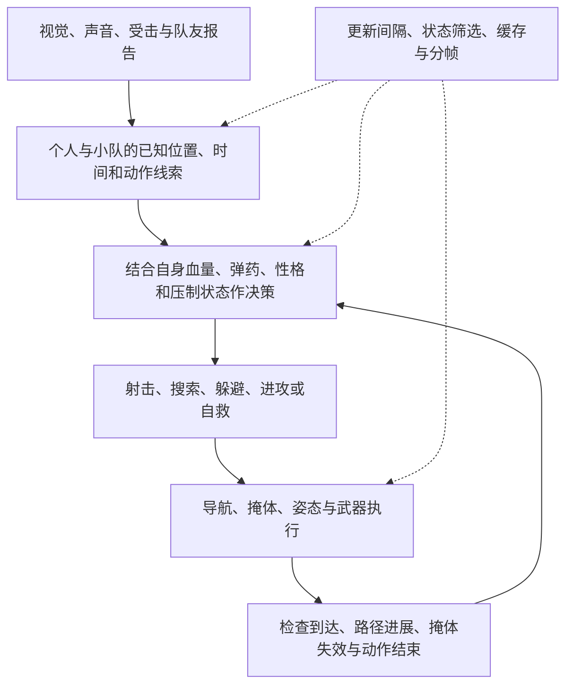

# SAIN 4.5.1 Bot 行为设计参考

整理日期：2026-09-23。用途：为 `ai_behavior_opt` 的后续行为开发提供参考。本文是源码分析与设计建议，不是 SAIN 游戏实测报告，也不表示下面的建议已经在本模组实现。

SAIN 最值得借鉴的是：**让感知、记忆、自身状态、战术选择和动作执行相互衔接**。听见声音会形成搜索线索，受到压制会改变进攻意愿，掩体失效会影响选点，换弹和治疗会改变行动优先级。这些因果关系比单纯提高命中率更能让 Bot 像真人。

对于本项目，建议先巩固“能到达、能停下、能恢复接管”的执行基础，再增加压制反馈、掩体失效、稳定性格与有限协作。完整视觉替换、全地图动态掩体和复杂投掷物系统放在后面评估。

## 1. 本次分析的版本与证据

| 项目 | 核对结果 |
| --- | --- |
| 本地参考仓库 | `reference/SAIN`，远端为 `ArchangelWTF/SAIN` |
| 本地分支 / 标签 | `reference/4.5.1` / `v4.5.1` |
| 固定提交 | `2d1d9257dbb3af535e9189e6181311f6355aec27`，2026-09-04，`Small fixes` |
| 源码版本声明 | `VersionPrefix=4.5.1`，`SptVersion=4.1.3`，见 [Directory.Build.props][version] |
| 本项目目标 | AI Behavior Opt 0.1.4；SPT 4.1.5 / EFT 0.16.9.5-40743 / BigBrain 1.5.0 |
| 分析方式 | 阅读具体方法、调用关系及被注释的分支；运行开销仅作静态预估 |

在线核对时，[v4.5.1 发布页](https://github.com/ArchangelWTF/SAIN/releases/tag/v4.5.1)标记为 Latest，发布于 2026-09-04，面向 SPT 4.1；[仓库首页](https://github.com/ArchangelWTF/SAIN)显示该维护分支已于 2026-09-13 归档。它是 [Solarint/SAIN](https://github.com/Solarint/SAIN) 的分支。本文的“当前”限定为**本项目正在参考、此次核实的 4.5.1 发布源码**，不代表所有第三方分支的最新实现。

下文源码链接均固定到上述提交，避免未来分支变化影响结论。发布说明用于核对版本，具体行为结论以代码为依据；目标游戏接口仍须按本机程序集验证。

## 2. 行为如何串起来

下面是对源码职责的概括，不是逐方法调用图。

主要入口是 [BotDecisionManager][decision]：先处理手雷危险，再处理自身恢复等条件，随后进入近距离战斗、继续移动到掩体、小队或个人交战判断。这个顺序具有实际行为含义，不能只把各模块独立增加到每帧更新中。

## 3. 值得借鉴的 14 项设计

### 3.1 把“敌人在什么位置”拆成不同来源的记忆

**SAIN 的实现：** `EnemyKnownPlaces` 分别保存最后看见、最后听见、队友看见、队友听见的位置，并记录个人或小队是否到达过线索点。`EnemyKnownChecker` 根据线索更新时间和搜索状态判断是否继续记住敌人；搜索可以延长记忆，但仍有 400 秒的最后更新时间上限。这不是默认记忆时长。[位置记忆][knowledge]、[遗忘判断][forget]

**优秀之处：** Bot 能针对已知区域继续行动，也能承认“已经搜过但没找到”。个人经验与队友报告可以赋予不同可信度，后续搜索、协作和遗忘拥有共同的数据基础。

**本项目建议：** 保持个人视觉、枪声快照与队友报告的来源区别；每条线索带时间、误差及来源，不让普通刷新无限续期。0.1.4 已有视觉/听觉快照、枪声线索保留和搜索到达/失败区分，可在其上补充有限的共享线索。不要照搬 SAIN 的长记忆上限。

### 3.2 听见声音与精确定位分开处理

**SAIN 的实现：** `HearingAnalysis` 先判断声音能否被听见，组合距离、声音类型、环境、遮挡状态、耳机、重型头盔、伤势和自身运动等条件；`HearingDispersion` 再产生带误差的估计位置。基础误差随距离和声音类型变化，朝向与已有线索也会影响误差。该分析器中的遮挡主要使用视线状态和系数，并非完整的声波传播模拟。[听见判断][hearing]、[定位误差][dispersion]

**优秀之处：** 同样是“附近有人开枪”，可以表现为明确转向、知道大致区域、只进入警戒等不同信息质量。玩家隐蔽移动和改变位置有意义。

**本项目建议：** 继续执行玩家枪声的 0～30 米快速警戒、30～120 米区域搜索、超过 120 米不额外响应规则；近弹和命中另行处理。优先增加少量环境修正，并保持同一轮连续枪声估计稳定。近距离定位也不能绕过视线与原生射击检查。

**移植注意：** 此版本 `CalcRandomizedPosition` 找不到估计点且没有旧线索时，会回退到敌人真实位置；其随机点检查从声源侧导航位置出发，不等于听声 Bot 能到达。我们应保留事件快照、允许线索失败，并从 Bot 所在位置验证路线。

### 3.3 发现速度受到姿态、暴露和注意方向影响

**SAIN 的实现：** `EnemyGainSightClass` 组合可见身体部位、移动、姿态、装备、高差、天气、时间、观察角度和已有线索附近的再次发现等因素；`EnemyVisionDistanceClass` 另行调整发现距离。发现所需时间和可发现距离是两个维度。[发现速度][vision-speed]、[发现距离][vision-distance]

**优秀之处：** 远处只露出一小部分身体、侧后方静止、近距离冲过正面，不必获得相同反应。刚从同一掩体再次探头也更容易被已有警戒的 Bot 注意。

**本项目建议：** 优先使用原生可靠可见性，仅补充少数标量修正，例如警戒方向、再次探头和移动状态；修正仍受等级基线与上下限约束。暂不替换为完整多身体部位视觉系统，也不让“更快发现”变成隔墙追踪。

### 3.4 性格决定风格，能力决定执行质量

**SAIN 的实现：** 性格分配考虑角色、等级区间、装备强度、概率和特殊覆盖；随机分配分支可以绕过常规属性要求。性格配置控制搜索、隐蔽、等待、冲锋、压制抵抗等行为。默认配置中，Chad 允许利用换弹/治疗时机冲锋，Rat 使用隐蔽搜索且关闭该冲锋选项。[分配逻辑][personality]、[默认性格][personality-defaults]

**优秀之处：** 同样能力的 Bot 可以有不同风险偏好。玩家无法只用一个固定节奏处理所有敌人，但各 Bot 的风格仍有一致性。

**本项目建议：** PMC 生成时固定少量倾向，例如谨慎、均衡、主动；等级仍线性影响反应、误差、记忆和战术成功倾向。高等级谨慎型可以更善于等待时机，不必全部变成冲锋型。Scav 固定模板，Boss/特殊角色继续保留原生逻辑。不要在每次决策时重新随机性格。

### 3.5 搜索有意愿、路线、节奏和结束条件

**SAIN 的实现：** `SearchDecider` 检查线索、个人/队友是否已搜索、性格是否允许听声搜索等条件；进入搜索还需通过路径判断。`SearchClass` 根据室内外、隐蔽倾向、冲刺和换弹调整速度、姿态及等待。`SearchPathFinder` 负责到达与搜索完成判定。[搜索决策][search-decision]、[搜索执行][search-action]、[搜索完成][search-path]

**优秀之处：** 搜索是一段有目的的行动，允许缓行、停顿、自救和结束。等待具有战术原因，便于与“站着不动的故障”区分。

**本项目建议：** 先复测 0.1.4 的完整路线分段推进与有限候选重试，再加入靠近疑似接触区的短暂停看。没有新线索不能无限追踪。日志必须分别记录：到达后未发现、目标不可达、线索到期、被紧急动作打断。

**移植注意：** SAIN 该版本会把到达部分路径末端计为线索已搜索。我们继续区分“无法继续接近”和“实际检查了区域”，不能将两者统一写成搜索成功。文件中的 Peek 命名也不足以证明已有完整逐房间清点系统。

### 3.6 掩体是相对威胁方向验证出来的

**SAIN 的实现：** 从周围碰撞体产生候选，结合最后已知敌人位置，检查背向位置、NavMesh、遮挡、完整路径、路径长度及与其他 Bot 的冲突；缓存和复查已有候选。掩体受击记录区分总受击、看不见来源、第三方和腿部等情况，并能标记暴露。`SAINCoverClass` 将这些状态用于候选过滤和暴露事件。[掩体采集][cover-finder]、[候选验证][cover-analyzer]、[受击记录][cover-point]、[掩体使用][cover-use]

**优秀之处：** 站在箱子旁不等于受到保护；能挡住这一条枪线，也不等于能挡住换角度后的枪线。候选可达性和掩体有效性被同时考虑。

**本项目建议：** 在已有局部掩体查询上增加“此位置仍持续中弹”的短期失效记录，避免反复返回同一个无效点；只有新命中、明显的新威胁方向或缓存到期才申请复查。姿态降低只在必要时改变，不能每轮判断都重复蹲起。

### 3.7 压制改变战术意愿，并随时间恢复

**SAIN 的实现：** `SAINBotSuppressClass` 累积并衰减压制值，结合距离、弹药口径配置和角色/性格抵抗，切换压制等级；状态变化时更新部分能力修正。`EnemyDecisionClass.CanBeAggressive` 在 Heavy/Extreme 压制下禁止主动攻击类选择。另外，主动压制射击有弹药、线索时效和目标保持检查。[压制系统][suppression]、[个人决策][enemy-decision]

**优秀之处：** 玩家打偏但子弹确实贴近 Bot 时，也能影响其行动。持续压制和偶尔一发枪声具有不同战术效果，Bot 又能在威胁停止后恢复。

**本项目建议：** 复用现有玩家命中/近弹事件维护有上限的压力值；只让它影响进攻倾向、掩体停留和必要的瞄准稳定。保留“安静五秒后评估推进”的既定规则与身体/弹药条件，不让单次事件造成永久趴伏。先做受压反馈，主动向遮挡边缘压制射击需要另外验证友军和射线安全。

### 3.8 自己要保命，也会识别对手暴露的行动机会

**SAIN 的实现：** `SelfActionDecisionClass` 区分开始和继续换弹、急救、手术等动作，并检查武器状态、交火和安全窗口。另一侧，听觉报告会把换弹、治疗、手术、搜刮等声响转换为敌方动作线索；个人冲锋判断还要求自身弹药、健康、路径与距离满足条件。[自救决策][self-action]、[声音动作线索][enemy-hearing]、[进攻时机][enemy-decision]

**优秀之处：** Bot 在失去战斗能力时优先恢复，同时能利用对手正在忙于其他动作的机会。形成可以理解的攻守交换，而不是无条件追击或一直躲藏。

**本项目建议：** 继续让原生治疗/换弹完成；后续只对玩家**确实被听见或看见**的动作建立短期机会标记。线索到期、再次受压或路线失败立即撤销，不直接查询不可见玩家是否残血。

**移植注意：** SAIN 的部分冲锋分支直接读取敌人 `HealthStatus`，搜索分支还比较敌方装备强度。可以参考风险判断思想，但本项目应从有来源的观测推断，不照搬这些信息读取方式。

### 3.9 射击节奏与武器和身体状态一致

**SAIN 的实现：** `Firemode` 根据距离和武器支持的模式，在不同半自动/自动阈值之间选择，并以 0.5 秒间隔检查，避免换弹、交互和正在射击时切换；`Firerate` 结合距离、武器类别、能力修正与有限随机得到射击间隔；`Recoil` 使用武器后坐力、姿态、移动、瞄准与手臂伤势计算偏移和恢复。[开火模式][firemode]、[射速][firerate]、[后坐力][recoil]

**优秀之处：** Bot 的枪械选择和身体处境有实际表现，近战与远战的开火节奏不同。能力提升不必只表现为第一枪更准。

**本项目建议：** 优先评估少量距离阈值和点射节奏；保留原生弹道和后坐力链路，避免重复叠加。所有新增修正仅在对玩家的接管上下文中有效，退出时恢复，不能把整个 Bot 的对 Bot 交火一起改变。

### 3.10 转角侧倾与贴身移动由空间条件触发

**SAIN 的实现：** 当前 `LeanClass.FindLean` 主要使用已计算的路径盲角和方向选择侧倾，平滑调整角度；奔跑、撤退、重压制等条件限制侧倾。备用侧向射线逻辑在该入口被注释。`DogFight` 在近战中区分接近、后退和射击，设置短暂保持时间。[侧倾][lean]、[近距离移动][dogfight]

**优秀之处：** 动作服务于观察角度、射界或保持距离，能减少机械地站定对枪；平滑变化与短暂保持也能减少动作闪烁。

**本项目建议：** 先实现一个明确用途：在已有路径的危险拐角降低速度、短暂停看；验证收益后再加受限侧倾。复用路线缓存，避免为了表现动作重新寻路。当前蹲起问题刚完成代码修复，应先确认姿态控制稳定，再增加更多姿态来源。

### 3.11 小队通过情报和当前任务产生协作

**SAIN 的实现：** `Squad` 按通信条件传递敌方动作报告，并用 `shallReportToSquad=false` 阻止报告再次转发。`SquadDecisionClass` 根据同目标队友的退却、搜索或压制状态，选择掩护、协同搜索、帮助或推进。部分动作的进入与维持阈值不同，例如掩护退却队友时使用不同距离和弹药阈值。[情报共享][squad]、[小队决策][squad-decision]

**优秀之处：** 队友的行为会影响自己的选择，有人撤退时可以有人掩护；不同任务不必让全队同时挤向同一点。共享报告不递归也减少了事件放大。

**本项目建议：** 在现有 20 米同组单跳警报上，后续增加有限报点延迟和一个推进名额，其他人观察或掩护。使用真实组关系与有时效的玩家线索，避免全图友军共享精确坐标。先做两种互补任务，再考虑更复杂的侧翼行动。

### 3.12 手雷针对最近线索，并考虑友军和投掷误差

**SAIN 的实现：** `GrenadeThrowDecider` 检查装备、当前交互、冷却、敌人信息新鲜度、距离以及友军接近情况；尝试最后已知位置或符合条件的盲角，室内外使用不同候选角度，并随距离加入投掷误差。总体决策把躲避危险手雷置于很高优先级。[投掷决策][grenade]、[决策优先级][decision]

**优秀之处：** 手雷可以迫使敌人离开已知遮挡区域，又不必表现为精确追踪不可见目标；投掷前有失败条件和重试间隔。

**本项目建议：** 保留为后期可选模块；先利用原生投掷与危险回避。需要新增时，只使用玩家最近线索，限制候选角度和尝试次数。不要在当前导航尚待复测时增加一套复杂投掷计算。

### 3.13 动作有优先级，也有继续执行的条件

**SAIN 的实现：** 总体决策以约 0.1 秒的局部间隔检查，并仅在决策或目标变化时发送决策事件。`ContinueMoveToCover` 会在条件适合时继续当前掩体移动，自救模块有继续动作判断；小队掩护、开火模式等模块还使用不同进入/退出阈值。这些机制是局部保持规则，不是保证所有动作稳定的全局锁。[总体决策][decision]、[自救延续][self-action]、[小队阈值][squad-decision]

**优秀之处：** 开始一个动作后，允许它产生结果，再考虑普通切换；紧急威胁仍可以打断。行为连续性直接影响“像不像真人”。

**本项目建议：** 保留单一姿态控制者、动作最短保持、紧急动作抢占和退出清理；明确“决策选中了动作”与“BigBrain 当前实际执行该层”的区别。0.1.4 的恢复接管和重复瞄准清理修复应优先复测。

### 3.14 导航持续检查进展，失败后有恢复路径

**SAIN 的实现：** 实际移动链路中的 `BotPathData.CheckStuck` 以 0.5 秒间隔检查拐角推进、方向和障碍，必要时请求重新寻路，并有条件尝试跳跃/翻越。`SAINMoverClass` 消费重算请求，失败时取消当前路径。触发效果受分支顺序和配置阈值共同影响。[路径进展][path-data]、[移动执行][mover]

**优秀之处：** 下达移动命令之后仍然检查是否真的前进，避免“状态是搜索，实际卡在门口”。失败被送回决策流程，便于恢复与诊断。

**本项目建议：** 继续用位移、路线剩余长度和时间判断进展，保留有限重试及冷却。等待预算、原生紧急动作暂停、真实卡住必须分别记日志。首先选择重算、替代点或结束线索，跳跃/翻越需单独验证，不能变成持续原地跳。

## 4. 性能上同样值得参考的做法

下表是源码中的具体控制手段，不代表所有 Bot 都按该频率完成工作，也不是 SAIN 与本项目的实测性能比较。

| 机制 | 源码证据 | 对本项目的启发 |
| --- | --- | --- |
| 思考与逐帧执行分离 | `BotDecisionManager` 局部决策间隔为 0.1 秒 | 减少无变化的普通决策；命中等紧急事件及时进入队列 |
| 视觉批量处理 | `VisionRaycastJob` 将每个待测身体部位的三类检查构造成批量射线，`ScheduleBatch` 后跨帧回收结果 | 大批量时可评估专用并行 API；少量玩家专属查询先用现有预算 |
| 掩体分帧、缓存与候选上限 | 碰撞体采集间隔约 4 秒；当前循环最多保留 5 个有效候选；候选处理间让出帧 | 缓存同一威胁下的结果，限制每帧失败候选数量，避免重复扫描 |
| 失败候选复用临时对象 | `CoverAnalyzer` 复用暂存 `PathData`，成功后才把对象交给保留的掩体 | 查询失败也不能产生大量短命对象 |
| 按人类玩家相关性分级 | `SAINAILimit` 对活动人类敌人取消其内部限制，否则按距离分级；检查间隔带小幅随机 | 对玩家交战优先分配预算，错开普通刷新；不要误认为它能解除外部 AI Limit 的休眠 |
| 状态变化才更新部分副作用 | 决策事件、压制能力修正等在状态变化时执行 | 少做重复姿态写入、瞄准清理和字符串日志 |

来源：[视觉任务][vision-job]、[掩体循环][cover-finder]、[掩体分析][cover-analyzer]、[内部 AI 分级][ai-limit]、[决策][decision]、[压制][suppression]。

**需要保留的限制：** 协程的 `yield` 只能把工作分开，不能中断已经开始的同步寻路；多个 Bot 的局部限频也不等于全局总量上限。视觉任务回收处的 `Complete()` 仍可能等待，并且该版本每批创建和释放临时原生数组。我们应继续使用全局共享查询额度、固定容量缓存和失败上限，性能热点出现后再决定是否引入批量任务。

## 5. 各设计的运行开销与瓶颈

以下分级描述**实现对应机制时的运行开销风险**，是静态分析预估，未进行本机 SAIN 对照。使用极高、高、中、低、极低五档；不是优化收益、开发难度或每个场景必然的耗时。多项叠加后的总开销需要重新测量。

| 机制 | 预估档次 | 具体瓶颈条件 |
| --- | --- | --- |
| 线索记忆与稳定性格 | 低 | 给每个 Bot 保存全部敌人及长期地点历史，导致数量相乘、容器扩容或清理集中 |
| 完整听觉定位 | 中 | 玩家持续自动射击、多个 Bot 同时接收，每次事件都尝试多次导航采样/路径计算 |
| 多部位视觉替换 | 高 | 活动 Bot、候选敌人和身体部位数同时增加；批量结果回收集中于同帧 |
| 搜索决策与完整路线 | 中 | 多名 Bot 同时追查不可达或不同楼层的线索，反复重算整条路线 |
| 动态掩体采集与验证 | 高 | 建筑密集区域多个 Bot 同时扫描碰撞体，并对大量失败候选计算路径和遮挡 |
| 压制值、性格与自救条件判断 | 低 | 单纯标量判断很轻；若每颗子弹都重新扫描全部 Bot、申请掩体或输出日志，会放大开销 |
| 射击节奏与后坐力标量 | 低 | 高频开火回调中重复获取组件、反射、分配对象或刷诊断文本 |
| 转角观察和贴身移动 | 中 | 为每次姿态/方向变化重新计算射线及路线，多个控制模块相互覆盖后反复重试 |
| 小队协同 | 中 | 每名成员遍历全部成员与全部敌人，或共享消息递归转发、全员同时换位 |
| 战术手雷 | 中 | 多 Bot 同时反复验证多角度投掷轨迹和友军距离 |
| 动作保持与失败原因记录 | 低 | 给每帧相同状态输出文本，或把每次控制交接都变成重新寻路 |
| 卡住恢复 | 中 | 大量 Bot 在同一门口/断开的 NavMesh 上反复重算、翻越和跳跃 |

当前 0.1.4 有独立行为检查和接口核对，但实际导航、控制交接与峰值仍待新版复测。旧版海岸线日志中的耗时不能作为 SAIN 对照，也不能证明新增这些设计后会更快。[本项目 0.1.4 验证范围](v0.1.4-navigation-fixes.md)

## 6. 与本项目的对应关系及建议顺序

下表的优先级是后续建议，不是本次实现承诺。以当前 0.1.4 源码和实现记录为基线。

| 顺序 | 方向 | 当前基础 | 建议下一步 |
| --- | --- | --- | --- |
| P0 | 搜索可靠性与控制交接 | 完整路线分段、有限重试、同动作恢复接管已有实现，待实测 | 用海岸线重复验证移动进展、实际接管、到达/失败及退出条件 |
| P0 | 姿态连续性与诊断 | 已修复姿态抢写及重复清瞄准，增加动作耗时细分 | 确认交战不再反复蹲起，找到慢调用对应的动作 |
| P1 | 局部掩体失效 | 已有命中/近弹触发局部掩体或合法趴伏 | 补充失效记录、候选复用和有限换位，避免重复选中无效点 |
| P1 | 受压反馈 | 已有玩家危险事件和安静五秒后推进评估 | 加有限压力累积与衰减，使连续近弹影响主动性 |
| P1 | 搜索节奏 | 已有线索区域与到达状态 | 加少量接触前观察与区域检查，不增加无限搜索 |
| P2 | 稳定性格 | 当前核心是等级能力基线，尚无 SAIN 式完整性格系统 | PMC 固定少量倾向，与等级成长分开 |
| P2 | 声音动作机会 | 已有声音入口与玩家过滤 | 核实可用动作声事件，再做带时效的换弹/治疗机会线索 |
| P2 | 简单小队互补 | 已有同组近距离单跳危险通知 | 一个推进者，其余观察/掩护；传播与任务数量都设上限 |
| P3 | 射击节奏与受限侧倾 | 目前主要使用原生执行能力 | 逐项验证对玩家接管与退出恢复，避免污染 Bot 对 Bot 行为 |
| P3 | 完整视觉、复杂手雷与大量战术动作 | 未整体替换 | 有明确实测收益和预算余量后再评估 |

**持续约束：** 新增拟人行为仅针对本地玩家的有效线索/交战上下文；其他 Bot 的枪声和相互交战继续走原生流程。PMC 等级可以提高判断质量，但不提高每 Bot 查询预算或更新频率。普通 Scav 与狙击 Scav 使用固定模板；Boss、护卫和其他特殊角色沿用原生专属行为。这些约束优先于早期设计文档中更宽的通用 AI 设想。

当前等级基线在 [SkillProfile.cs](../src/AiBehavior.Core/SkillProfile.cs) 中按 1～60 级线性插值：反应 0.9→0.3 秒、瞄准稳定 0.8→0.35 秒、听觉误差基线 8→3 米、记忆 6→14 秒、战术倾向 0.30→0.85。它们是参数基线；枪声近距离规则和实际听觉距离修正另行应用，不等于任何距离都固定使用 8→3 米误差。后续性格不应破坏这条明确的成长规则。

## 7. 不能仅凭名称或简介认定的能力

| 容易产生的理解 | 本次源码核实结果 | 本项目处理 |
| --- | --- | --- |
| 有 `FlankAction.cs` 就有完整包抄系统 | 该固定版本的文件无实际实现；小队压制/推进有明确代码，但不能据此扩大为成熟多方向包围 | 把“单个侧移者”作为待设计功能 |
| `SAINBotUnstuckClass` 包含传送方法，因此日常自动传送脱困 | 其 `BotUnstuck` 主协程相关旧处理被注释；实际进展检查见 `BotPathData` / `SAINMoverClass` | 不把旧方法或空循环列为已验证能力 |
| 侧倾始终依赖额外左右射线 | 当前 `FindLean` 走盲角方向分支，备用射线调用被注释 | 以当前调用路径估计开销 |
| 完成搜索必然表示到过声源区域 | 当前部分路径末端也可能被标记已搜索 | 继续区分不可达与真正到达 |
| 所有战术信息都来自严格感知 | 存在真实位置回退、直接读取健康或装备状态的分支 | 为本项目每种战术输入标明来源和时效 |
| README 有手电、激光、夜视等功能，就能直接移植 | 简介描述了相关功能，本次未逐一审计完整设备补丁链路 | 不计入本次优先落地清单，单独分析后再决定 |

来源：[空的 FlankAction 文件][flank]、[旧脱困类][old-unstuck]、[实际移动进展][path-data]、[侧倾入口][lean]、[搜索完成][search-path]、[听觉回退][dispersion]、[冲锋判断][enemy-decision]、[搜索判断][search-decision]、[SAIN 简介][readme]。

## 8. 后续实测应观察的场景

以下是本项目采用这些设计后的验收方向，不是已通过的测试结果。

| 场景 | 应观察到的行为 | 重点诊断 |
| --- | --- | --- |
| 玩家约 60 米开枪打偏，随后静默换位 | 向枪声估计区域有限接近，不随静默玩家实时转向 | 声音来源、误差、线索时间、路线目标、实际移动进展 |
| 玩家在 20 米近处开枪，双方隔墙 | 快速警戒、尝试取得射界，不能穿墙精确开火 | 警戒是否及时，开火是否仍受可见性约束 |
| Bot 躲到掩体后继续被命中 | 识别该点失效并有限换位，姿态变化有保持 | 命中来源、掩体失效原因、冷却、姿态控制者 |
| 连续近弹停止，五秒未出现新危险 | 按状态评估推进或原生恢复，不能永久趴伏 | 压力衰减、危险时间、弹药/健康、推进阻断原因 |
| 玩家在可听范围换弹或治疗 | 有能力且条件适合的 PMC 利用短期机会；未感知者不响应 | 机会线索来源、到期时间、动作选择与取消原因 |
| 玩家打一组 Bot | 有界通知和互补任务，避免全员重算并挤向同一点 | 组标识、传播次数、推进名额、查询队列 |
| Bot 对 Bot 开火，玩家没有提供新线索 | 不启动本模组新增的玩家反应计算 | 输入过滤、查询计数、原生交战是否保留 |
| 搜索目标在断开的导航区域 | 有限重试后结束或降级，不能刷失败日志和无限原地蹲起 | 路径状态、失败次数、结束原因、单帧耗时峰值 |

性能对照需要固定地图、Bot 数量、活动上限和配置，分别记录全客户端帧时间、插件动作/查询耗时及 GC。应关注同一时间段的高分位和峰值，不能仅用战局平均耗时掩盖短时卡顿。

## 9. 本次交付范围

新增本分析文档并在 README 添加入口。未更改游戏逻辑、SAIN 参考源码或发布 DLL；运行性能影响为 **极低**，依据是纯文档不进入游戏执行路径，本次改动无新增游戏运行瓶颈。后续若直接复用 SAIN 代码，应按该固定版本的 [MIT 许可证][license] 保留所需声明；本文只作设计分析。

[version]: https://github.com/ArchangelWTF/SAIN/blob/2d1d9257dbb3af535e9189e6181311f6355aec27/Directory.Build.props
[readme]: https://github.com/ArchangelWTF/SAIN/blob/2d1d9257dbb3af535e9189e6181311f6355aec27/README.md
[license]: https://github.com/ArchangelWTF/SAIN/blob/2d1d9257dbb3af535e9189e6181311f6355aec27/LICENSE
[decision]: https://github.com/ArchangelWTF/SAIN/blob/2d1d9257dbb3af535e9189e6181311f6355aec27/SAIN/Classes/Bot/Decision/BotDecisionManager.cs
[knowledge]: https://github.com/ArchangelWTF/SAIN/blob/2d1d9257dbb3af535e9189e6181311f6355aec27/SAIN/Classes/Bot/EnemyClasses/Position/EnemyKnownPlaces.cs
[forget]: https://github.com/ArchangelWTF/SAIN/blob/2d1d9257dbb3af535e9189e6181311f6355aec27/SAIN/Classes/Bot/EnemyClasses/Checkers/EnemyKnownChecker.cs
[hearing]: https://github.com/ArchangelWTF/SAIN/blob/2d1d9257dbb3af535e9189e6181311f6355aec27/SAIN/Classes/Bot/Sense/Hearing/HearingAnalysis.cs
[dispersion]: https://github.com/ArchangelWTF/SAIN/blob/2d1d9257dbb3af535e9189e6181311f6355aec27/SAIN/Classes/Bot/Sense/Hearing/HearingDispersion.cs
[vision-speed]: https://github.com/ArchangelWTF/SAIN/blob/2d1d9257dbb3af535e9189e6181311f6355aec27/SAIN/Classes/Bot/EnemyClasses/Vision/EnemyGainSightClass.cs
[vision-distance]: https://github.com/ArchangelWTF/SAIN/blob/2d1d9257dbb3af535e9189e6181311f6355aec27/SAIN/Classes/Bot/EnemyClasses/Vision/EnemyVisionDistanceClass.cs
[personality]: https://github.com/ArchangelWTF/SAIN/blob/2d1d9257dbb3af535e9189e6181311f6355aec27/SAIN/Models/Preset/Personalities/PersonalityDictionary.cs
[personality-defaults]: https://github.com/ArchangelWTF/SAIN/blob/2d1d9257dbb3af535e9189e6181311f6355aec27/SAINServerMod/Extensions/PersonalityDefaultsExtensions.cs
[search-decision]: https://github.com/ArchangelWTF/SAIN/blob/2d1d9257dbb3af535e9189e6181311f6355aec27/SAIN/Classes/Bot/Search/SearchDecider.cs
[search-action]: https://github.com/ArchangelWTF/SAIN/blob/2d1d9257dbb3af535e9189e6181311f6355aec27/SAIN/Classes/Bot/Search/SearchClass.cs
[search-path]: https://github.com/ArchangelWTF/SAIN/blob/2d1d9257dbb3af535e9189e6181311f6355aec27/SAIN/Classes/Bot/Search/SearchPathFinder.cs
[cover-finder]: https://github.com/ArchangelWTF/SAIN/blob/2d1d9257dbb3af535e9189e6181311f6355aec27/SAIN/Components/CoverFinderComponent.cs
[cover-analyzer]: https://github.com/ArchangelWTF/SAIN/blob/2d1d9257dbb3af535e9189e6181311f6355aec27/SAIN/Classes/Coverfinder/CoverAnalyzer.cs
[cover-point]: https://github.com/ArchangelWTF/SAIN/blob/2d1d9257dbb3af535e9189e6181311f6355aec27/SAIN/Classes/Coverfinder/CoverPoint.cs
[cover-use]: https://github.com/ArchangelWTF/SAIN/blob/2d1d9257dbb3af535e9189e6181311f6355aec27/SAIN/Classes/Bot/SAINCoverClass.cs
[suppression]: https://github.com/ArchangelWTF/SAIN/blob/2d1d9257dbb3af535e9189e6181311f6355aec27/SAIN/Classes/Bot/WeaponFunction/SAINBotSuppressClass.cs
[enemy-decision]: https://github.com/ArchangelWTF/SAIN/blob/2d1d9257dbb3af535e9189e6181311f6355aec27/SAIN/Classes/Bot/Decision/EnemyDecisionClass.cs
[self-action]: https://github.com/ArchangelWTF/SAIN/blob/2d1d9257dbb3af535e9189e6181311f6355aec27/SAIN/Classes/Bot/Decision/SelfActionDecisionClass.cs
[enemy-hearing]: https://github.com/ArchangelWTF/SAIN/blob/2d1d9257dbb3af535e9189e6181311f6355aec27/SAIN/Classes/Bot/EnemyClasses/Other/EnemyHearing.cs
[firemode]: https://github.com/ArchangelWTF/SAIN/blob/2d1d9257dbb3af535e9189e6181311f6355aec27/SAIN/Classes/Bot/WeaponFunction/Firemode.cs
[firerate]: https://github.com/ArchangelWTF/SAIN/blob/2d1d9257dbb3af535e9189e6181311f6355aec27/SAIN/Classes/Bot/WeaponFunction/Firerate.cs
[recoil]: https://github.com/ArchangelWTF/SAIN/blob/2d1d9257dbb3af535e9189e6181311f6355aec27/SAIN/Classes/Bot/WeaponFunction/Recoil.cs
[lean]: https://github.com/ArchangelWTF/SAIN/blob/2d1d9257dbb3af535e9189e6181311f6355aec27/SAIN/Classes/Bot/Mover/LeanClass.cs
[dogfight]: https://github.com/ArchangelWTF/SAIN/blob/2d1d9257dbb3af535e9189e6181311f6355aec27/SAIN/Classes/Bot/Mover/DogFight.cs
[squad]: https://github.com/ArchangelWTF/SAIN/blob/2d1d9257dbb3af535e9189e6181311f6355aec27/SAIN/Classes/BotManager/Squad.cs
[squad-decision]: https://github.com/ArchangelWTF/SAIN/blob/2d1d9257dbb3af535e9189e6181311f6355aec27/SAIN/Classes/Bot/Decision/SquadDecisionClass.cs
[grenade]: https://github.com/ArchangelWTF/SAIN/blob/2d1d9257dbb3af535e9189e6181311f6355aec27/SAIN/Classes/Bot/WeaponFunction/Grenades/GrenadeThrowDecider.cs
[path-data]: https://github.com/ArchangelWTF/SAIN/blob/2d1d9257dbb3af535e9189e6181311f6355aec27/SAIN/Classes/Bot/Mover/BotPathData.cs
[mover]: https://github.com/ArchangelWTF/SAIN/blob/2d1d9257dbb3af535e9189e6181311f6355aec27/SAIN/Classes/Bot/Mover/SAINMoverClass.cs
[vision-job]: https://github.com/ArchangelWTF/SAIN/blob/2d1d9257dbb3af535e9189e6181311f6355aec27/SAIN/Classes/BotManager/Jobs/VisionRaycastJob.cs
[ai-limit]: https://github.com/ArchangelWTF/SAIN/blob/2d1d9257dbb3af535e9189e6181311f6355aec27/SAIN/Classes/Bot/SAINAILimit.cs
[flank]: https://github.com/ArchangelWTF/SAIN/blob/2d1d9257dbb3af535e9189e6181311f6355aec27/SAIN/Layers/Combat/Solo/FlankAction.cs
[old-unstuck]: https://github.com/ArchangelWTF/SAIN/blob/2d1d9257dbb3af535e9189e6181311f6355aec27/SAIN/Classes/Bot/SAINBotUnstuckClass.cs
